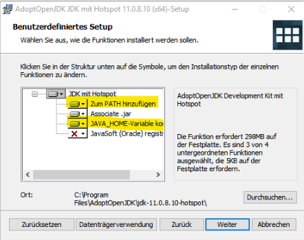
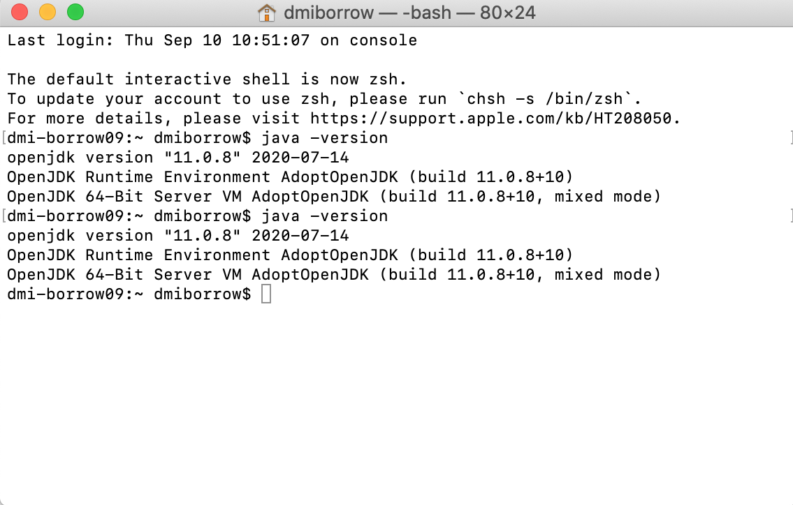
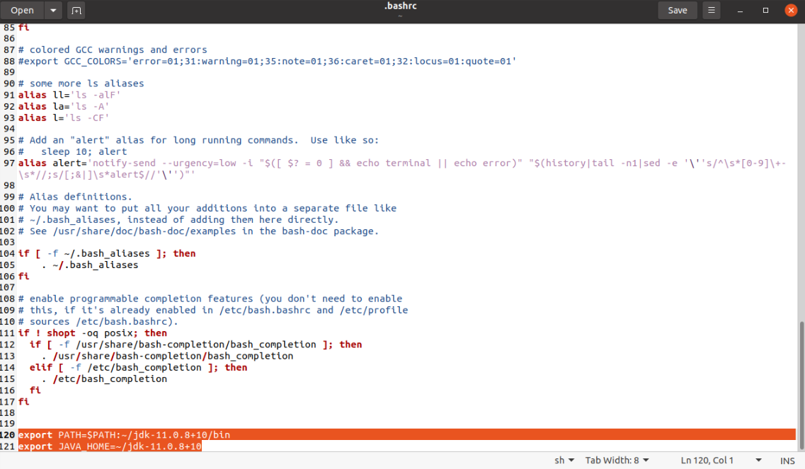
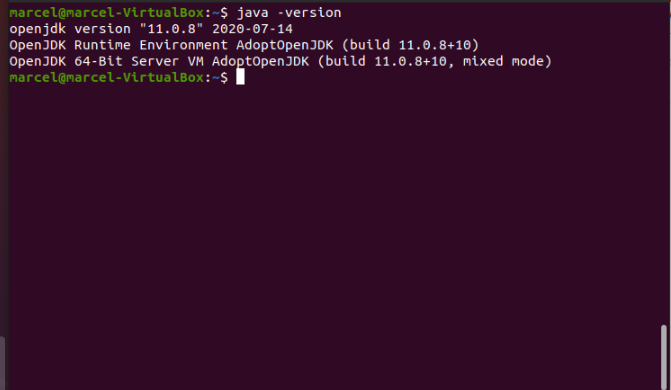

---
# Feel free to add content and custom Front Matter to this file.
# To modify the layout, see https://jekyllrb.com/docs/themes/#overriding-theme-defaults

layout: default
title : Übersicht
---
# Installation des Java Development Kits

Um Java Programme kompilieren und ausführen zu können, müssen Sie auf Ihrem Computer das Java Development Kit (JDK) installieren. 
Es gibt verschiedene Versionen des JDKs, die zum Teil auch von unterschiedlichen Organisationen angeboten und gepflegt werden.
Grundsätzlich sollten Sie die in diesem Kurs entwickelten Programme mit jedem JDK ab Version 8 kompilieren und ausführen können. 
Wir empfehlen Ihnen jedoch, die Version 11 vom OpenJDK zu verwenden.

## Download

Nachdem Sie auf die Seite [AdoptOpenJDK](https://adoptopenjdk.net/?variant=openjdk11&jvmVariant=hotspot) gelangt sind, sollte die Version (OpenJDK 11) und der JVM Typ (Hotspot) schon ausgewählt sein, ansonsten sollten Sie diese Auswahl manuell treffen. 


Die blaue Schaltfläche (Latest release / Neueste Veröffentlichung ) lädt den Installer für Ihr aktuelles Betriebssystem herunter.

## Installation unter Windows

Führen Sie die Datei, die sie in vorigem Schritt heruntergeladen haben aus. 
Akzeptieren Sie die allgemeinen Geschäftsbedingungen und drücken Sie weiter bis sie 
auf einen Dialog mit dem Namen *Benutzerdefiniertes Setup* gelangen. 
Hier ist es wichtig, dass Sie die Einstellungen so wählen, dass der PATH und die Variable JAVA_HOME gesetzt wird (siehe Screenshot)

.

Drücken Sie nun weiter. Auf dem letzten Dialog drücken Sie den Knopf *Installieren* um die Installation zu starten. 

Nachdem Sie das JDK installiert haben, öffnen Sie ein Terminal (durch Drücken der Windows Taste und Eingabe von ```cmd```). Geben Sie dann folgendes ein um zu sehen, ob Java erfolgreich installiert wurde:

```
java -version
```

Falls die Installation funktioniert hat, sollten Sie folgende Meldung sehen:


## Installation unter MacOS

Führen Sie die Datei, die sie in vorigem Schritt heruntergeladen haben aus. Akzeptieren Sie die allgemeinen Geschäftsbedingungen und drücken Sie weiter und am Ende auf *Installieren*.

Nachdem Sie das JDK installiert haben öffnen Sie ein Terminal (z.B. indem Sie in Spotlight ```terminal``` eingeben). Geben Sie dann folgendes ein um zu sehen, ob Java erfolgreich installiert wurde:

```
java -version
```
Falls die Installation funktioniert hat, sollten Sie folgende Meldung sehen:



## Installation unter Linux

Unter Linux haben Sie im vorigen Schritt kein graphisches Installationsprogramm sondern ein tar.gz Archiv (mit einem Namen  wie ```OpenJDK11U-jdk_x64_linux_hotspot_11.0.8_10.tar.gz```) heruntergeladen.  
Entpacken Sie dieses Archiv. Sie finden darin einen Ordner mit dem Namen ```jdk-11.0.8+10```. Kopieren Sie diesen an eine von Ihnen gewählte Stelle, wie zum Beispiel ihr Home-Verzeichnis. Im Folgenden nehmen wir an, dass Sie dieses in ihrem Home-Verzeichnis entpackt haben. Nun müssen wir noch die Umgebungsvariablen ```PATH``` und ```JAVA_HOME``` setzen, damit ihre Java Installation auch gefunden wird. Dazu öffnen Sie die Datei
```~/.bashrc``` mit einem Editor und fügen  
```export PATH=$PATH:~/jdk-11.0.8+10/bin```   
```export JAVA_HOME=~/jdk-11.0.8+10```  
(die im Screenshot orange markierten Einträge) am Ende der Datei hinzu.



Wenn Sie nun ein *neues* Terminal öffnen und ```java -version ``` eingeben, 
sollte Sie folgende Ausgabe sehen:




 
