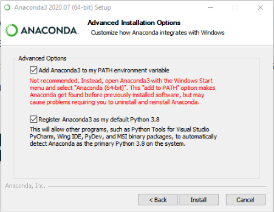
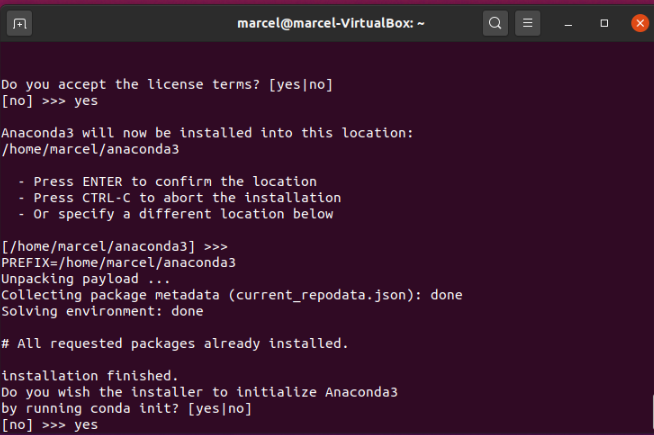
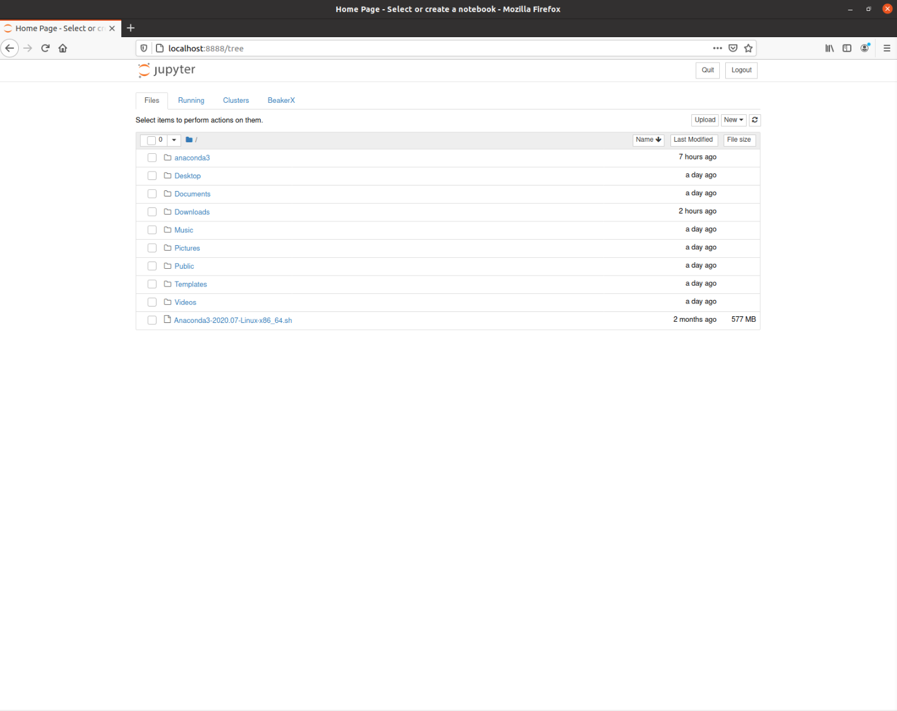

---
# Feel free to add content and custom Front Matter to this file.
# To modify the layout, see https://jekyllrb.com/docs/themes/#overriding-theme-defaults

layout: default
title : Übersicht
---

# Installationsanleitung Jupyter-Notebooks mit Java Unterstützung

Um in Jupyter-Notebooks Java programmieren zu können, brauchen wir drei Programme: 

1. Das *Java Development Kit* (JDK)
2. Die [Jupyter-Notebook](https://jupyter.org/) Umgebung
3. den [BeakerX](http://beakerx.com/) Kern um Java Programme in Jupyter-Notebooks ausführen zu können. 

Im Folgenden beschreiben wir diese Installationsschritte im Detail. 

*Sollte etwas unklar sein oder auf ihrem System nicht funktionieren, können 
Sie im [Forum](https://adam.unibas.ch/goto_adam_frm_1024469.html) auf Adam Fragen stellen. In der Woche vom 21 - 25. September werden wir zusätzlich
Installationsupport in den Übungsstunden der "Erweiterten Grundlagen der Programmierung" anbieten. Sie können diesen Support auch in Anspruch nehmen, wenn Sie nur die
"Grundlagen der Programmierung" besuchen.*

## Installation des Java Development Kits 

Im ersten Schritt müssen Sie das Java Development Kit (JDK) installieren. Da das auch JDK unabhängig von Jupyter-Notebooks benötigt wird, finden Sie die Anleitung in einem separaten Dokument:

* [Installationsanleitung Java Development Kit](installation-jdk)

Bitte führen Sie diese Installation als erstes durch.

Wenn Sie java erfolgreich installiert haben, können Sie nun die Jupyter-Notebook Umgebung installieren.

## Installation von Jupyter-Notebooks 

Am einfachsten geht die Installation mit der [Anaconda Distribution](https://www.anaconda.com/). Diese stellt eine komfortable Installationsumgebung zur Verfügung, mit der wir alle benötigten Komponenten mit wenigen Befehlen installieren können. 
Die Anaconda Distribution gibt es für die Betriebssysteme Windows, Linux und MacOS.

*Es gibt viele weitere Möglichkeiten wie Sie Jupyter-Notebooks installieren können. Details zu alternativen Verfahrenfinden Sie auf der Webpage von [Jupyter](https://jupyter.org) und [BeakerX](https:///beakerx.com/). Beachten Sie, dass wir aber nur Support für die von uns beschriebene Installationsvariante geben können.*


### Windows 

Laden Sie das graphische Installationsprogramm von [dieser Seite](https://www.anaconda.com/products/individual) herunter. Der Download Link befindet sich fast am Ende der Seite.

Führen Sie das Installationsprogramm aus und folgen Sie den Instruktionen.
Wenn Sie zu folgendem Dialog kommen, aktivieren Sie (trotz Warnung) die Option *Add Anaconda3 to my PATH environment variable*:


Danach führen Sie die Installation wie vorgesehen durch. 

### MacOS
Laden Sie das graphische Installationsprogramm von dieser Seite (https://www.anaconda.com/products/individual) herunter. Der Download Link befindet sich fast am Ende der Seite.

Führen Sie das Installationsprogramm aus und folgen Sie den Instruktionen.
Sie können alle Voreingestellten Einstellungen direkt übernehmen.


### Linux

Öffnen Sie ein Terminal und führen Sie folgenden Befehl aus. 
```bash
wget https://repo.anaconda.com/archive/Anaconda3-2020.07-Linux-x86_64.sh
```

Dieser lädt Installationsprogramm aus dem Internet herunterlädt und speichert es im aktuellen Verzeichnis.

Nun können Sie die Installationsroutine mit folgendem Befehl aufrufen:

```bash
bash Anaconda3-2020.07-Linux-x86_64.sh
```
Folgen Sie nun den Anweisungen des Installationsprogramms. Akzeptieren Sie die allgemeinen Geschäftsbedingungen indem sie (durch wiederholtes drücken der Enter oder Leertaste) nach unten scrollen und dann ```yes``` eingeben. Übernehmen Sie bei allen nachfolgenden Fragen *ausser der letzten*  die Standardeinstellung, indem Sie Enter drücken. Bei der letzten Frage *Do you wish the installer to initialize Anaconda3* müssen sie ```yes``` eingeben. 



## Installation von BeakerX
Als nächstes müssen wir noch BeakerX installieren. 
*Dazu müssen Sie ein **neues** Terminal öffnen.* Unter Windows machen Sie dies indem Sie die Windows-Taste drücken und ```cmd``` eingeben. In MacOS, indem Sie in Spotlight ```terminal``` eingeben.


Geben Sie nun folgende Befehl ein um BeakerX zu installieren:
```bash
conda install -c conda-forge beakerx
```
Geben Sie im folgenden Prompt ```y``` um die Installation zu starten. 


## Starten von Jupyter-Notebooks

Nun können Sie die Notebook-Umgebung mit folgendem Befehl starten:

```bash
jupyter-notebook
```

Es sollte sich nun ein Browser-Fenster öffnen, welches etwa wie folgt aussieht:


Im nächsten Schritt können Sie nun testen ob alles funktioniert. Folgen Sie dazu den Schritten in [dieser Anleitung](installation-test).