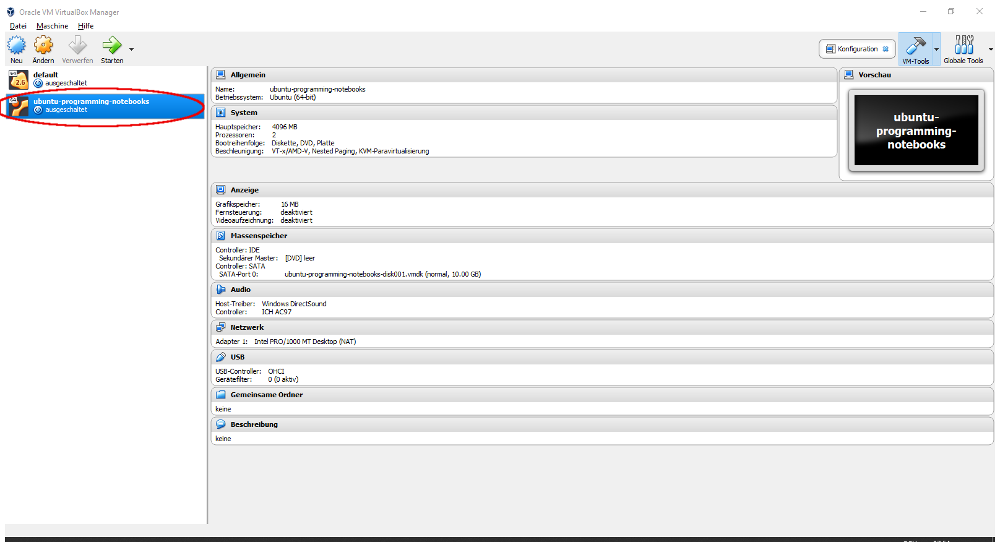
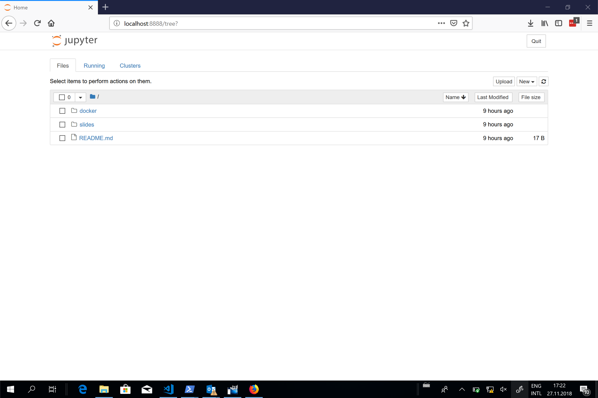

# Installation von Jupyter-Notebooks für Java

*Jupyter-Notebooks sind eine Webanwendung, die es ermöglicht Programme in einem Webbrowser zu schreiben, zu kommentieren und auszuführen. Jupyter Notebooks wurden ursprünglich für Python geschrieben, sind aber inzwischen auch für andere Programmiersprachen verfügbar. Seit kurzen steht auch eine Umgebung für Java zur Verfügung.
Da diese aber noch nicht im Standardumfang von Jupyter Notebooks enthalten ist, sind noch ziemlich viele Arbeitsschritte für die Installation nötig. Wir stellen Ihnen deshalb eine virtuelle Maschine, respektive einen Docker Container, mit der bereits fertig augesetzten Umgebung zur Verfügung. Diese Anleitung führt Sie durch die Installation.*

## 1. Virtualbox oder Docker

Sie haben zwei verschiedene Möglichkeiten die Jupyter Notebooks zu installieren: 
1. Sie nutzen Oracle Virtualbox und lassen darauf eine virtuelle Maschine laufen, welche wir für Sie fertig aufgesetzt haben. 
2. Sie nutzen Docker und den von uns vorbereiteten Docker Container.

Die erste Variante ist einfacher und kann komplett via einer Graphischen Oberfläche durchgeführt werden. Dies ist die empfohlene Variante für alle, die noch nicht so mit der Kommandozeile vertraut sind oder einfach auf Nummer sicher gehen wollen. Der Hauptnachteil davon ist, dass Sie etwas Festplattenspeicher verschwenden (die Virtuelle Maschine ist ca 5 GB gross) und die Ausführung ist eventuell etwas langsamer als bei der Verwendung von Docker.

Die zweite Variante, die Nutzung von Docker, ist deutlich schlanker. Wir empfehlen diese Variante für alle die Wert auf ein schlankes System legen, versiert mit der Kommandozeile sind, oder sich schon immer mal diese populäre Technologie anschauen wollten. Docker kann man unter allen gängigen Betriebssystemen (Windows, Linux, MacOS) installieren.  Am einfachsten ist die Installation aber unter Linux, da Docker ursprünglich für Linux entwickelt wurde.

## 2. Installation mittels Virtualbox

1. Gehen Sie auf die [Downloadseite](https://www.virtualbox.org/wiki/Downloads) von Oracle Virtualbox 
2. Wählen Sie unter *VirtualBox 5.2.22 platform packages* das Ihrem Betriebssystem entsprechende Paket und installieren Sie dieses. 
    * (Falls nötig finden Sie Weitere Details und Screenshots zur Installation von Virtualbox in dieser [Anleitung](https://www.wikihow.com/Install-VirtualBox))
3. Laden Sie die Virtuelle Maschine mit den Jupyter-Notebooks von [hier](https://drive.switch.ch/index.php/s/FYNLOsoo5RalhYS) herunter.
4. Starten Sie nun Virtualbox. Sie sollten folgendes Fenster sehen 
5. Importieren Sie die in Schritt 3 heruntergeladene Datei indem Sie ```Datei->Appliance importieren``` wählen, und die entsprechende Datei im Dialogfenster auswählen. Drücken Sie ```Weiter``` und wählen Sie ```Importieren``` auf der nächsten Seite. 
6. Starten Sie die Virtuelle Machine indem Sie diese in der Liste auf der Linken Seite die soeben importierte Maschine auswählen und den Startbutton drücken.



Herzliche Gratulation! Die Installation ist hiermit abgeschlossen und Sie können mit den Notebooks arbeiten. 

### 2.1 Starten von Jupyter Notebooks
Auf dem Desktop in ihrer Virtuellen Maschine sollten Sie nun zwei Icons sehen: ```start-notebook-server``` und ```start-notebook-client```

Starten Sie den Server indem Sie das entsprechende Icon doppelklicken. Starten Sie danach den Client. Sie sollten nun folgendes Browserfenster sehen:


*Wichtig! Nach langer Inaktivität wird der Screen der Virtuellen Machine gesperrt und sie werden nach dem Passwort gefragt. Der Benutzername für die Virtualbox ist ```jupyter``` und das Passwort ```notebook```.*

## 3. Installation mittels Docker

1. Installieren Sie Docker auf ihrem System:
    * Anleitung für [Windows](https://docs.docker.com/docker-for-windows/install/)
    * Anleitung für [MacOS](https://docs.docker.com/docker-for-mac/install/)
    * Anleitung für Linux: [Ubuntu](https://docs.docker.com/install/linux/docker-ce/ubuntu/), [Debian](https://docs.docker.com/install/linux/docker-ce/debian/), [Fedora](https://docs.docker.com/install/linux/docker-ce/fedora/), [CentOS](https://docs.docker.com/install/linux/docker-ce/centos/)
2. Öffnen Sie eine Kommandozeile (Terminal). Sie sollten in dieser Kommandozeile Administrationsrechte haben.
    * Unter Windows können Sie die Kommandozeile als Administrator öffnen indem Sie im Startmenu auf den Kommandozeileneintrag Rechtsklicken und "als Administrator ausführen" auswählen.
    * Unter Linux und Mac können Sie die Kommandozeile als normaler Nutzer ausführen und dann ```sudo su ``` aufrufen um Administrator zu werden.


Geben Sie nun folgenden Befehl ein um den Container mit dem Jupyter Notebook auf ihr System zu bringen.
```
docker pull marcelluethi/programming-notebooks:1.1
```

*Falls Sie in diesem Schritt eine Fehlermeldung bekommen, könnte es daran liegen, dass Docker nicht gestartet ist. Unter Windows und MacOS starten Sie Docker, in dem Sie die Docker Anwendung aufrufen (Sie finden diese im Startmenu). Unter Linux sollte dieses Problem nicht auftauchen.*


### Starten von Jupyter Notebooks

Um Jupyter notebook server zu starten, geben sie folgenden Befehl ein
```
docker run -p 8888:8888 -it marcelluethi/programming-notebooks:1.1
```

Starten Sie nun einen Browser und geben Sie folgende URL ein 
```
http://localhost:8888
```


Falls Sie folgende Webseite sehen, war die Installation erfolgreich.



*Achtung:* Falls Sie nicht direkt Docker, sondern Docker Toolbox verwenden, müssen Sie stattdessen folgende URL eingeben:
```
http://192.168.99.100:8888 
```

Der Grund dafür ist, dass Docker Toolbox nicht direkt auf dem Hostsystem, sondern in einer separaten virtuellen Maschine läuft (welche standardmässig die IP Adresse 192.168.99.100 hat).

